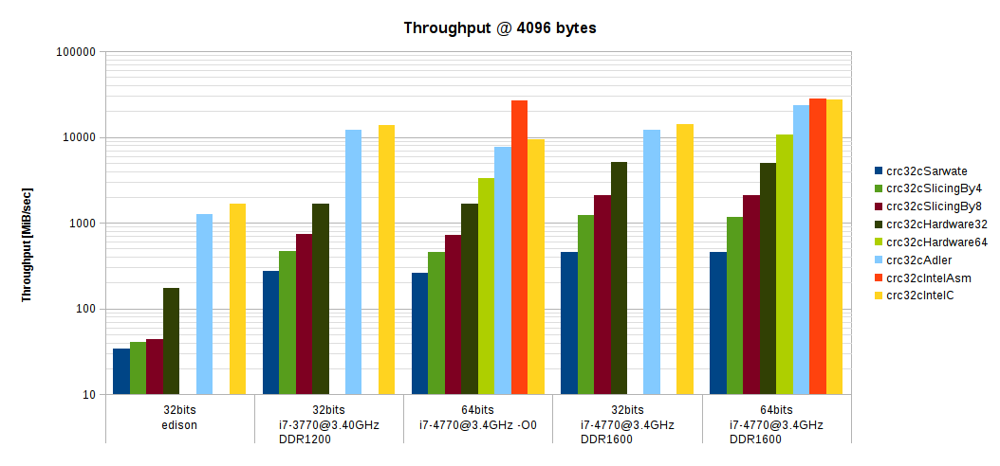

# Highly optimized CRC32C lib and benchmark

This project implements various crc32c algorithmes and provides a benchmark routine for them. The main goal is to take the fastest routine and make it available on the Intel Edison platform. It would also be interesting to port to arm (Raspberry Pie) and possibly arm MCU's, but that hasn't been done yet.

As it appears that the fastest algorithm available uses the CRC instruction available on Intel SSE 4.2 processors and where efficient uses 3 ```crc32q``` instructions 3 seperate parts of the buffer which a single core can execute in parallel. This compensates for the latency of a single crc32q instruction. Recombining the 3 CRC-32C bytes is done using the ```pclmulqdq``` instruction, which has overhead of its own, and makes this code path only efficient for buffer sizes above 216 bytes. The algorithem has been taken from Intels ```crc_iscsi_v_pcl.asm``` assembly code (which is available in a modified form in the linux kernel) and using a C wrapper (```crcintelasm.cc```) included into this project.

To be able to run this code on 32 bit platforms first it has been ported to C (crc32intelc) where possible, a small amount of inline assembly is required. Certain parts of the code depend on the bitness, crc32q is not available on 32 bits and neither is movq, these are put in macro's (crc32intel.h) with alternative code for 32 bit platforms.

Being written in C it is of course easier to maintain and hopfully some bright minds will come up with ideas to optimize the code further.

## Acknowledgements

Much of the code is taken from the benchmarking code retrieved from
<a href="http://www.evanjones.ca/crc32c.html" target="_blank">http://www.evanjones.ca/crc32c.html</a>.

The already highly optimized code from Mark Adler (madler@alumni.caltech.edu) is taken from
<a href="http://stackoverflow.com/questions/17645167/implementing-sse-4-2s-crc32c-in-software/17646775" target="_blank">http://stackoverflow.com/questions/17645167/implementing-sse-4-2s-crc32c-in-software/17646775</a>

```crc_iscsi_v_pcl.asm``` was dowloaded from Intel's web site, and is described in the white paper "Fast CRC
Computation for iSCSI Polynomial Using CRC32 Instruction", Vinodh Gopal, Jim Guilford, Erdinc Ozturk,
Gil Wolrich, Wajdi Feghali, Martin Dixon (IA Architects, Intel Corporation), Deniz Karakoyunlu (PhD Worcester, Polytechnic Institute), 2011.

## Building

To build for your native platform just type:
```sh
make all
```

This will build the code with maximum optimizations on (which has a large effect on performance, a factor 3x with Adler, Hardware32, Hardware64, IntelC, SlicingBy8, 2.6x for SlicingBy4 and 1.7 for Sarwate) and no debug symbols.

To force 32 bits code on a 64 bit platform type:
```sh
CPU_TYPE=x32 make all
```

To force 64 bits code on a 32 bit platform type:
```sh
CPU_TYPE=amd64 make all
```

To enable debug info and disable optimizations type:
```sh
DEBUG=TRUE make all
```

## Tests

`./crc32c_test` performs a series of tests on each algorithm to make sure they have the same results.

## Benchmarks

Benchmarks can be run with the built-in benchmark program as follows:

```sh
./crc32cbench
```

The following graph shows the results for a buffer size of 4096 bytes.


On i7 with Adler and IntelC using 64bits gives a factor 2x improvement as expected. On 64 bits, using SlicingBy8 (the best software based method) is 5.1x better than Sarwate. Using Hardware64 is 4.2x better that SlicingBy8. IntelC is 2.7x better than Hardware64.

On 32-bit Edison IntelC is 8.8x better than SlicingBy8. 
On 64-bit Edison all optimized methods (Hardware64, Adler, Intel) are regressing and slower than Hardware64. The fastest method is slower than the fastest on 32-bits.

## License

This repository is licensed under the
[BSD 2-clause License](http://opensource.org/licenses/BSD-2-Clause). See the
LICENSE file.
